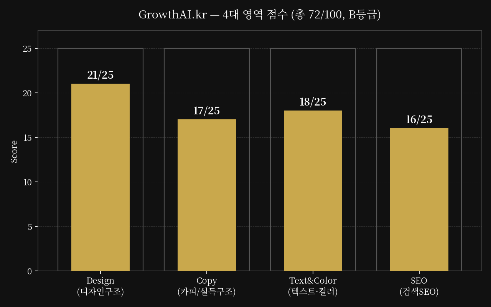
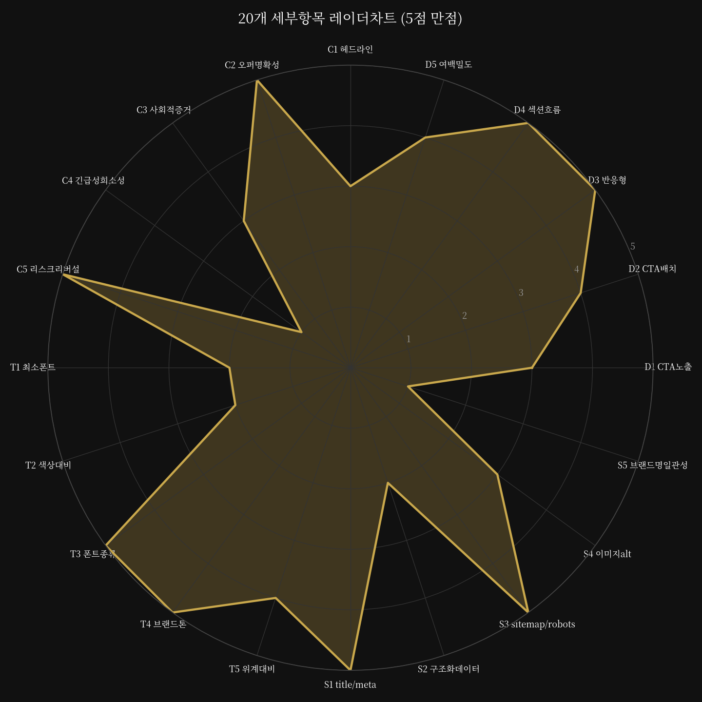

# GrowthAI.kr 사이트 전환 지수 진단 리포트

진단 대상: https://growthai.kr/ (및 /basics, sitemap.xml 등재 47개 URL)
진단 방식: 라이브 페이지 확인 + 소스코드(React/Vite, `growthai` 저장소) 직접 분석
진단일: 2026-07-09
출력 등급: **무료 티어** (STEP8 규칙에 따라 카피/설득구조 1개 영역만 전체 상세 + 수정
프롬프트 공개, 나머지 3개 영역은 점수만 공개)

## STEP 0 — 사전 필터 확인값

| 항목 | 값 |
|---|---|
| 시장 | 한국 (도메인 .kr, 콘텐츠 전량 한국어 우선) |
| 업종 | 디지털 상품/온라인 강의(SaaS형 결제·구독 혼합) |
| 사이트 목적 | 즉시판매(1회성 강의 결제) + 구독전환(월간 멤버십) 혼합 |
| 타겟 연령 | 전연령(직장인~50대 혼재) → 본문 최소 폰트 기준 16px 적용 |
| 월 방문자 | 100~1,000명 (사용자 제공, GA 미연결) |
| 핵심 병목 | 방문은 있는데 구매전환이 없다 → 카피/설득구조에 채점 가중 |
| 한국형 신뢰신호 | 토스페이먼츠 연동 확인(`TossCheckoutButton.tsx`), 카카오 채널 링크는 포트폴리오
상세페이지에만 존재(`PortfolioDetailPage.tsx` L528), 홈/베이직스 페이지엔 없음 |

## 트래픽 스냅샷

| 추정 방문자 | 이탈률 | 업종 평균 대비 전환율 |
|---|---|---|
| 월 100~1,000명 (사용자 제공 구간) | 확인 불가 — GA/GTM 미연결 | 확인 불가 — 정보 제공 필요 |

코드 근거 기반 속도 리스크 신호: 홈페이지 1개 화면에 자동재생 `<video>` 태그가
4개(히어로, 섹션2, 메트릭, 커리큘럼 섹션) 이상 삽입되어 있음(`src/App.tsx`
`VIDEO_URLS.hero/section2/metrics/technology`). 실측 로딩 속도는 Lighthouse 등 별도
측정이 필요하나(확인 불가), 다수의 자동재생 비디오 배경은 LCP(최대 콘텐츠풀 페인트)
지연 요인으로 통상 지목되는 패턴입니다.

---

## STEP 3 — 헤드라인 스코어

```
━━━━━━━━━━━━━━━━━━━━━━━━━━━━
 종합 전환 지수: 72 / 100    등급: B
 (디자인구조 21/25 + 카피구조 17/25 + 텍스트컬러 18/25 + SEO 16/25)
━━━━━━━━━━━━━━━━━━━━━━━━━━━━
```

**한줄진단:** 긴급성 부재 + 브랜드명 불일치

---

## STEP 4 — 시각화





**레이더차트 항목 코드표**

| 코드 | 항목 | 코드 | 항목 |
|---|---|---|---|
| D1 | CTA 노출(above-the-fold) | C4 | 긴급성/희소성 |
| D2 | CTA 개수/배치 | C5 | 리스크 리버설/FAQ |
| D3 | 반응형 대응 | T1 | 본문 최소 폰트 |
| D4 | 섹션 흐름/논리 | T2 | 색상 대비(WCAG) |
| D5 | 여백/시각 밀도 | T3 | 폰트 종류 개수 |
| C1 | 헤드라인 구체성 | T4 | 브랜드 톤 일관성 |
| C2 | 오퍼 명확성 | T5 | 텍스트 위계 대비 |
| C3 | 사회적 증거 | S1 | title/meta 존재 |
| S2 | 구조화데이터(JSON-LD) | S4 | 이미지 alt 텍스트 |
| S3 | sitemap/robots | S5 | 브랜드명 일관성 |

---

## STEP 2 — 4대 영역 상세 채점

### 🔓 카피/설득구조 — 17/25 (무료 전체 공개 영역)

**[C1] 헤드라인 구체성 — 점수: 3/5**
현재 상태: 홈 히어로 1차 헤드라인은 "이 설득 구조 하나면 팔릴 가능성이 높아집니다"
(`src/config/content.ts` L87) — 숫자·기한 없음. 반면 리드용 `/basics` 페이지 헤드라인
서브카피는 "1,200명이 검증한 AI 1인 기업 로드맵"으로 구체적 숫자 포함(`BasicsPage.tsx`
L205) — 페이지 간 헤드라인 설득력 편차가 확인됨.
근거: Eugene Schwartz/David Ogilvy 헤드라인 원칙 관점에서 구체적 숫자·시간 프레임은
클릭률·신뢰도를 높이는 요소로 꼽힘.
결함: 방문자가 처음 도달하는 홈 헤드라인에 정량적 근거가 빠져 있어 1차 임팩트가 약함.

▼ 아래 프롬프트를 복사해 사용 중인 AI(Claude, GPT, Cursor 등)에 붙여넣으세요 ▼
```
내 홈페이지 히어로 헤드라인을 "이 설득 구조 하나면 팔릴 가능성이 높아집니다"에서
구체적 숫자·시간 프레임이 들어간 버전으로 바꿔줘. 브랜드 톤(AI FLOWE, 골드×블랙,
Toss 스타일 굵은 타이포)은 유지하고, 아래 조건을 만족하는 대안 3가지를 제시해줘.
① 15,000+ 수강생 데이터를 활용한 숫자형 헤드라인
② "며칠/몇 주" 등 기한이 들어간 헤드라인
③ 기존 톤(문제→해결 대비 구조)을 유지한 절제된 숫자형 헤드라인
각 안마다 왜 전환에 유리한지 1문장 근거도 같이 알려줘.
```

**[C2] 오퍼 명확성(가격/구성) — 점수: 5/5**
현재 상태: 3단 가격 카드(월간멤버십 ₩49,000/$39, 실전 부트캠프 ₩390,000/$290 — "인기
과정" 배지, VVIP ₩2,900,000/$2,190)에 원화·달러 병기, 각 카드마다 포함 항목 3~4개
bullet 명시(`src/App.tsx` PRICING 섹션).
근거: Cialdini 앵커링/미끼효과 관점에서 3단 구성 + 중앙 옵션 강조는 표준적인 가격
심리 기법으로 평가됨.
결함: 없음(양호). 다만 VVIP 카드의 "무이자 12개월" 문구가 텍스트로만 존재하고
시각적으로 강조되지 않아 결제 장벽 완화 신호가 약하게 전달됨(감점 아님, 참고용).

▼ 복사해서 붙여넣으세요 ▼
```
내 가격 카드 3단 구성(월간멤버십/부트캠프/VVIP) 중 VVIP 카드에 있는 "무이자 12개월"
할부 정보를 시각적으로 더 눈에 띄게 만들고 싶어. 배지, 아이콘, 강조색 활용 등 대안
2가지를 제안해줘. 기존 골드(#C9A84C)/블랙 톤과 카드 레이아웃 구조는 유지해줘.
```

**[C3] 사회적 증거(후기/실적) — 점수: 3/5**
현재 상태: 후기 3건이 익명 이니셜(김○○/박○○/한○○)로 표기되고 별점 UI만 있음
(`src/App.tsx` TESTIMONIALS 섹션), 실명·사진·후기 캡처 인증 없음. 메트릭 "4.9/5.0,
15,000+ 수강생, 25+ 도구"는 출처 표기 없음(`content.ts` L118-124). 특히 `/basics`
페이지의 케이스스터디에는 "$420K/월, 순이익 87%, Jake Leader $420K, David Poliku
$200K"라는 구체적 해외 수익 사례가 등장하나(`BasicsPage.tsx` L32) 근거 자료 링크나
검증 수단이 없음 — **확인 불가, 검증 불가능한 소득 주장**.
근거: Google Search Essentials 콘텐츠 모범사례는 검증 불가능한 소득·성과 주장을
신뢰성 저하 요소로 간주하며, 국내 표시광고법 관점에서도 근거 없는 소득 사례 인용은
과장광고 리스크로 분류됨(법률 자문 아님, 일반 원칙 안내).
결함: 검증 수단 없는 해외 소득 사례 인용이 신뢰도 리스크와 광고 규제 리스크를 동시에
유발할 수 있음.

▼ 복사해서 붙여넣으세요 ▼
```
내 랜딩페이지에 있는 "$420K/월, 순이익 87%" 같은 해외 케이스스터디 수치를 그대로
쓰기엔 출처 검증이 안 돼서 리스크가 있어. 아래 두 방향으로 대안을 만들어줘.
① 실제 검증 가능한 국내 수강생 후기(성명 이니셜+구체적 결과+날짜) 형식으로 재구성한
   예시 3개
② 소득 주장 없이 "학습 성과/실행 결과" 중심으로 바꾼 대안 카피 2개
각 안이 왜 신뢰도와 광고 규제 리스크를 동시에 낮추는지 근거도 설명해줘.
```

**[C4] 긴급성/희소성 — 점수: 1/5**
현재 상태: 홈페이지 9개 섹션(`src/App.tsx` 전체) 어디에도 카운트다운, 마감일,
"선착순 N명", "이번 기수 마감" 같은 긴급성/희소성 장치가 없음. 가격 섹션에도 기간
한정 문구가 없음.
근거: Cialdini 희소성 원칙 관점에서, 긴급성 신호 부재는 "나중에 결제해도 된다"는
지연 행동을 유발하는 전형적 원인으로 지목됨. 사용자가 직접 지목한 핵심 병목
("방문은 있는데 구매전환이 없다")과 가장 직접적으로 연결되는 항목.
결함: 지금 결정해야 할 이유가 사이트 어디에도 없어, 방문자가 이탈 후 재방문하지
않는 구조.

▼ 복사해서 붙여넣으세요 ▼
```
내 강의 판매 페이지 가격 섹션(월간멤버십/부트캠프/VVIP)에 과장 없이 쓸 수 있는
긴급성/희소성 문구를 만들어줘. 조건:
① 허위 마감일이 아닌, 실제 운영 가능한 방식(예: 기수제 모집, 특정 인원 한정 코칭
   슬롯, 이번 달 신규 등록 보너스 등) 기반 아이디어 3가지
② 각 아이디어별로 실제 어떻게 운영하면 되는지 1~2문장 실행 방법
③ "반드시 매출이 오릅니다" 같은 보장 표현은 넣지 말고, 톤은 기존 골드×블랙 프리미엄
   톤 유지
```

**[C5] 리스크 리버설/FAQ 반박 — 점수: 5/5**
현재 상태: FAQ 8문항이 실제 구매 반대 이유(코딩 필요 여부, 매출 실효성, 유튜브 수익화
기간, 해외결제, N8N 난이도, 1인 운영 가능성, 수강기간, 글로벌 진출)를 조목조목
반박(`content.ts` L162-206). "30일 성과 보장 · 결과 없으면 전액 환불" 문구가 가격
섹션과 클로징 CTA 섹션 2곳에 반복 노출(`App.tsx`).
근거: Jay Abraham의 리스크 리버설(Risk Reversal) 관점에서 환불 보장 + 반론 대응 FAQ가
이중으로 구성된 것은 우수 사례로 평가됨.
결함: 없음(양호).

카피/설득구조 소계: **3 + 5 + 3 + 1 + 5 = 17/25**

---

### 🔒 디자인구조 — 21/25 (점수만 공개, 수정 프롬프트 잠김)

| 항목 | 점수 | 현재 상태 한줄 요약 |
|---|---|---|
| D1 CTA 노출(above-the-fold) | 3/5 | 데스크톱 고정 네비바엔 CTA 버튼 상시 노출되나, 모바일 상단바는 로고+햄버거만 존재해 CTA가 메뉴를 열어야 보임(`Navbar.tsx` MOBILE 블록) |
| D2 CTA 개수/배치 | 4/5 | 네비/Pain섹션/가격3종/클로징까지 CTA 6개 이상 배치, 문구 일관성 양호 |
| D3 반응형 대응 | 5/5 | Tailwind `sm/md/lg` 반응형 클래스와 `clamp()` 유동 타이포 전역 적용 확인 |
| D4 섹션 흐름/논리 | 5/5 | Hook→PAS(문제)→Metrics→후기→창업자신뢰→커리큘럼→로드맵→가격→FAQ→클로징 순으로 교과서적 세일즈 페이지 구조(`App.tsx` 주석에 "Jay Abraham PAS Frame" 명시) |
| D5 여백/시각 밀도 | 4/5 | 섹션 패딩 `py-16~py-32` 일관 적용(코드 기준 추정, 실사용성은 스크린샷 확인 필요) |

**소계: 21/25** 🔒 수정 프롬프트 15개 중 5개는 유료 리포트(9,900원)에서 확인 가능합니다.

---

### 🔒 텍스트·컬러 — 18/25 (점수만 공개, 수정 프롬프트 잠김)

| 항목 | 점수 | 현재 상태 한줄 요약 |
|---|---|---|
| T1 본문 최소 폰트 | 2/5 | FAQ 답변 13px, 테스트모니얼 본문 14px 고정 등 다수 구간이 전연령 기준 16px 미달 |
| T2 색상 대비(WCAG) | 2/5 | `white/50`(대비 5.32:1)·`white/70`(9.90:1)은 통과하나, `white/20~30`(대비 1.66~2.45:1)은 WCAG 3:1 미달 — 실측 근거 아래 표 참조 |
| T3 폰트 종류 개수 | 5/5 | Pretendard(한글)+Playfair Display+Cormorant Garamond 총 3종, 가이드 기준(3종 이내) 충족 |
| T4 브랜드 톤 일관성 | 5/5 | 골드(#C9A84C)×블랙 배색이 전 페이지 일관 적용 |
| T5 텍스트 위계 대비 | 4/5 | 헤드라인(흰색 그라데이션, 고대비) vs 본문(45~50% 불투명, 중간대비) 위계 뚜렷 |

**실측 대비 비율(WCAG 2.2 기준, 배경 #000000):**

| 조합 | 대비 비율 | 판정 |
|---|---|---|
| white/70 (테스트모니얼 본문) | 9.90 : 1 | PASS |
| white/50 (본문 다수) | 5.32 : 1 | PASS |
| white/45 | 4.43 : 1 | 큰 텍스트만 PASS |
| white/40 | 3.66 : 1 | 큰 텍스트만 PASS |
| white/30 (FAQ 서브라벨 등) | 2.45 : 1 | **FAIL** |
| white/25 (클로징 디스클레이머 등) | 2.03 : 1 | **FAIL** |
| white/20 | 1.66 : 1 | **FAIL** |
| 골드 #C9A84C on 블랙 | 9.19 : 1 | PASS |
| 버튼 텍스트 #0a0a0a on 골드 #C9A84C | 8.66 : 1 | PASS |

**소계: 18/25** 🔒 수정 프롬프트 15개 중 5개는 유료 리포트(9,900원)에서 확인 가능합니다.

---

### 🔒 검색 SEO — 16/25 (점수만 공개, 수정 프롬프트 잠김)

| 항목 | 점수 | 현재 상태 한줄 요약 |
|---|---|---|
| S1 title/meta 존재 | 5/5 | `Seo.tsx` 컴포넌트로 페이지별 title/description 동적 관리, 홈·/basics 등 고유 값 확인 |
| S2 구조화데이터(JSON-LD) | 2/5 | 홈(`/`) 1개 페이지에만 WebSite 스키마 적용, sitemap 47개 URL 중 나머지는 `schema` prop 미전달 |
| S3 sitemap/robots | 5/5 | `robots.txt`에 `/dashboard`, `/lesson` 정상 차단 + Sitemap 라인 명시, `sitemap.xml` 47개 URL 등재 양호 |
| S4 이미지 alt 텍스트 | 3/5 | 샘플 확인(창업자 사진, 도서 이미지)은 `alt` 속성 존재. 전체 이미지 전수 검수는 **확인 불가 — 자동 스캔 신뢰도 낮음(멀티라인 JSX), 수동 검수 필요** |
| S5 브랜드명 일관성 | 1/5 | 타이틀태그/SEO 기본값="GrowthAI"(`index.html`, `Seo.tsx` SITE_NAME)이나 실제 로고·강사소개 표기 브랜드명="AI FLOWE"(`content.ts` brandName, founder.title) — **검색엔진 인지 브랜드명과 화면 표시 브랜드명 불일치** |

**소계: 16/25** 🔒 수정 프롬프트 15개 중 5개는 유료 리포트(9,900원)에서 확인 가능합니다.

---

## STEP 9 — 위원회 최종 요약

가장 큰 병목은 **카피/설득구조의 긴급성·희소성 부재(C4, 1/5)**입니다. 월 100~1,000명
규모의 방문 트래픽이 이미 발생하고 있음에도, 지금 결제해야 할 이유를 만드는 장치가
사이트 어디에도 없어 사용자가 지목한 "방문은 있는데 구매전환이 없다"는 병목과 정확히
일치합니다. 여기에 검색SEO 영역의 **브랜드명 불일치(S5, 1/5)** — 타이틀 태그는
"GrowthAI"인데 실제 화면과 강사 소개는 "AI FLOWE"로 표기되는 문제 — 가 겹쳐, 검색
엔진과 재방문자 모두에게 "이 사이트가 정확히 무엇을 하는 곳인지"에 대한 인지가
이중으로 흐려지는 구조입니다.

이 두 가지를 먼저 해결하면 — 즉 ①실행 가능한 수준의 긴급성 장치(기수제 모집, 한정
코칭 슬롯 등)를 도입하고 ②브랜드명을 GrowthAI 또는 AI FLOWE 중 하나로 통일하면 —
이미 유입되고 있는 방문자가 "지금 결정해야 할 이유"와 "이 브랜드가 무엇인지"를 더
분명히 인지하게 되어, 통상적으로 체류 후 이탈·결정 지연이 줄어드는 방향으로 개선될
것으로 기대됩니다. (매출/전환율 수치를 보장하는 서술은 아닙니다.)

---

## 🔒 잠긴 항목 안내

나머지 15개 항목의 상세 근거 + 수정 프롬프트, Before→After 예시(STEP5), 실행
로드맵(STEP6), 20항목 전체 스코어카드(STEP7)는 다음 단계에서 열람 가능합니다.

- **유료 리포트(9,900원 상당 분량)**: 4개 영역 전체 상세 + 영역별 프롬프트 1개씩(총 4개)
  + Before/After·로드맵·전체 스코어카드
- **유료 구독(19,900원/월 상당 분량)**: 20개 항목 수정 프롬프트 전체 무제한 + 수정 후
  재진단(예: 72→85 개선폭 시각화)

> 참고: 본 사이트는 회장님 소유 사이트이므로, 실제 결제 없이도 "전체 잠금 해제해서
> 계속 진단해줘"라고 말씀하시면 나머지 15개 항목 + 로드맵 + Before/After까지 바로
> 이어서 작성해 드립니다.
